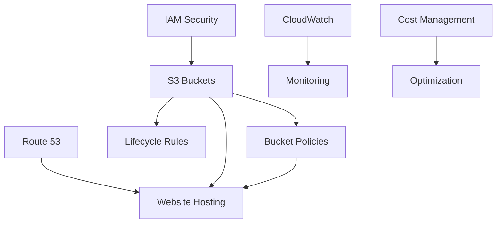

# ⚙️ All Configuration Files - AWS S3 Storage & Website Hosting Case Study

## 📋 Overview

This document provides a comprehensive overview of all AWS configurations used in the **XYZ Corporation S3 Storage & Website Infrastructure** case study. Each configuration file is organized by service and function to ensure easy reference and implementation.

---

## 🏗️ Configuration Architecture

```
configurations/
├── 📄 all_configuration_files.md      # This overview document
├── 🪣 bucket-policies/                 # S3 bucket access policies
│   ├── storage-bucket-policy.json     # Storage bucket security policy
│   └── website-bucket-policy.json     # Website hosting bucket policy
├── 🔄 lifecycle-rules/                 # S3 lifecycle management
│   ├── storage-lifecycle-rule.json    # 75-day lifecycle policy
│   └── website-lifecycle-rule.json    # Website files lifecycle policy
├── 🌐 dns-configs/                     # Route 53 DNS configurations
│   ├── hosted-zone-config.json        # Hosted zone setup
│   ├── a-record-config.json           # Root domain A record
│   └── cname-record-config.json       # www subdomain CNAME record
├── 📊 monitoring/                      # CloudWatch monitoring setup
│   ├── s3-dashboard-config.json       # CloudWatch dashboard
│   ├── storage-alarms-config.json     # Storage monitoring alarms
│   └── website-alarms-config.json     # Website performance alarms
├── 🔒 security/                        # Security and access control
│   ├── iam-policies.json              # IAM user and role policies
│   ├── bucket-cors-config.json        # Cross-origin resource sharing
│   └── encryption-config.json         # S3 server-side encryption
└── 💰 cost-optimization/               # Cost management configurations
    ├── budget-alerts-config.json      # AWS budget configurations
    ├── cost-allocation-tags.json      # Resource tagging strategy
    └── storage-class-analysis.json    # Storage class optimization
```

---

## 🔧 Configuration Summary

### 📊 AWS Services Configured

| Service | Configuration Files | Purpose |
|---------|-------------------|---------|
| **Amazon S3** | 6 files | Storage buckets, policies, lifecycle, website hosting |
| **Route 53** | 3 files | DNS management and custom domain routing |
| **CloudWatch** | 3 files | Monitoring, metrics, and alerting |
| **IAM** | 3 files | Security policies and access management |
| **Cost Management** | 3 files | Budget alerts and cost optimization |

### 🎯 Key Configuration Areas

#### 🪣 **S3 Storage Configuration**
- **Storage Bucket**: `xyz-corp-storage-[suffix]`
  - Versioning: Enabled
  - Encryption: SSE-S3
  - Lifecycle: 75-day automated transitions
  - Access: Private with controlled permissions

- **Website Bucket**: `your-domain.com`
  - Static Website Hosting: Enabled
  - Public Access: Configured for web hosting
  - Index Document: index.html
  - Error Document: error.html

#### 🔄 **Lifecycle Management**
- **Transition Timeline**:
  - Day 0-30: S3 Standard
  - Day 30-60: S3 Standard-IA
  - Day 60-75: S3 Glacier
  - Day 75+: Automatic deletion
- **Cost Savings**: Estimated 60% reduction in storage costs

#### 🌐 **DNS Configuration**
- **Hosted Zone**: Managed through Route 53
- **A Record**: Root domain → S3 website endpoint
- **CNAME Record**: www subdomain → S3 website endpoint
- **TTL Settings**: Optimized for performance and reliability

#### 📊 **Monitoring Setup**
- **CloudWatch Metrics**: S3 request metrics, storage metrics
- **Alarms**: Storage limits, request rates, error rates
- **Dashboards**: Real-time monitoring and visualization

#### 🔒 **Security Configuration**
- **Bucket Policies**: Public read for website, private for storage
- **IAM Roles**: Least privilege access principles
- **Encryption**: Server-side encryption for all objects
- **Access Logging**: Comprehensive audit trails

#### 💰 **Cost Optimization**
- **Budget Alerts**: Monthly spending thresholds
- **Resource Tagging**: Cost allocation and tracking
- **Storage Analytics**: Usage patterns and optimization opportunities

---

## 🚀 Implementation Order

Follow this sequence for optimal configuration deployment:

### Phase 1: Foundation Setup
1. **Security Configurations** (`security/`)
   - IAM policies and roles
   - Encryption settings
   - CORS policies

### Phase 2: Storage Infrastructure
2. **Bucket Policies** (`bucket-policies/`)
   - Storage bucket access control
   - Website bucket public access

3. **Lifecycle Rules** (`lifecycle-rules/`)
   - Storage lifecycle policies
   - Website files lifecycle management

### Phase 3: Website and DNS
4. **DNS Configurations** (`dns-configs/`)
   - Hosted zone setup
   - Domain record configurations

### Phase 4: Operations
5. **Monitoring Setup** (`monitoring/`)
   - CloudWatch dashboards
   - Alerting configurations

6. **Cost Management** (`cost-optimization/`)
   - Budget alerts
   - Cost allocation tags

---

## 📋 Configuration Validation Checklist

### ✅ Pre-Implementation
- [ ] AWS CLI configured with appropriate permissions
- [ ] Custom domain name registered and accessible
- [ ] Required AWS services enabled in target region
- [ ] Cost budgets and alerts configured

### ✅ Post-Implementation
- [ ] All bucket policies applied and tested
- [ ] Lifecycle rules active and validated
- [ ] DNS records propagated and functional
- [ ] Monitoring dashboards displaying data
- [ ] Security configurations verified
- [ ] Cost tracking and optimization active

---

## 🔗 Configuration Dependencies

### Service Interdependencies


### Configuration Order Dependencies
1. **IAM** must be configured before S3 operations
2. **S3 buckets** must exist before applying policies
3. **Website bucket** must be configured before DNS setup
4. **Monitoring** can be configured after basic infrastructure
5. **Cost optimization** should be implemented throughout

---

## 🚨 Important Notes

### ⚠️ Security Considerations
- Always review bucket policies before applying
- Ensure website bucket public access is intentional
- Regular audit of IAM permissions
- Monitor access patterns for anomalies

### 💰 Cost Management
- Lifecycle policies require time to show cost benefits
- Monitor storage class transitions in first 30 days
- Set up budget alerts before significant deployments
- Regular review of unused resources

### 🔧 Maintenance Requirements
- Monthly review of lifecycle policy effectiveness
- Quarterly security audit of access permissions
- Regular monitoring of website performance metrics
- Annual cost optimization analysis

---

## 📞 Support and Documentation

**Configuration Support:**
- **Author:** Himanshu Nitin Nehete
- **Institution:** iHub Divyasampark, IIT Roorkee
- **Email:** [himanshunehete2025@gmail.com](mailto:himanshunehete2025@gmail.com)

**Reference Documentation:**
- [AWS S3 Configuration Guide](https://docs.aws.amazon.com/s3/latest/userguide/)
- [Route 53 Configuration Reference](https://docs.aws.amazon.com/route53/latest/developerguide/)
- [CloudWatch Configuration Best Practices](https://docs.aws.amazon.com/cloudwatch/latest/userguide/)

---

## 📄 Version History

| Version | Date | Changes | Author |
|---------|------|---------|--------|
| 1.0 | 2024-09-04 | Initial configuration documentation | Himanshu N. Nehete |

---

**🎯 Next Steps:** Review each configuration subfolder for detailed implementation files and follow the implementation guide for step-by-step deployment instructions.

**Keywords:** AWS Configuration, S3 Setup, Route 53 DNS, CloudWatch Monitoring, IAM Security, Cost Optimization, Infrastructure as Code
