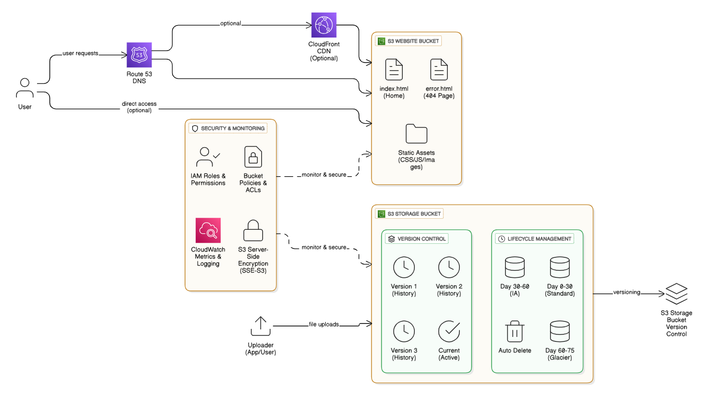

# 🚀 Implementation Guide: AWS S3 Storage & Website Hosting

## 📋 Overview

This comprehensive implementation guide provides step-by-step instructions for deploying the **XYZ Corporation S3 Storage & Website Infrastructure** case study. Follow this guide to implement unlimited cloud storage, lifecycle management, version control, and static website hosting with custom domain integration.

---

## 🎯 Implementation Objectives

By completing this implementation, you will achieve:
- ✅ **Unlimited Cloud Storage** with global accessibility
- ✅ **Automated Lifecycle Management** with 75-day deletion policy
- ✅ **Version Control & Recovery** for data protection
- ✅ **Static Website Hosting** with custom domain integration
- ✅ **Custom Error Handling** with branded 404 pages
- ✅ **Zero Data Loss** during all storage operations

---

## 📋 Prerequisites

Before starting the implementation, ensure you have:

### 🔐 AWS Account Requirements
- [ ] Active AWS account with billing enabled
- [ ] AWS CLI installed and configured
- [ ] IAM user with appropriate S3, Route 53, and CloudWatch permissions
- [ ] Access keys configured locally

### 🌐 Domain Requirements
- [ ] Custom domain name registered
- [ ] Access to domain's DNS management
- [ ] Understanding of DNS record types (A, CNAME, etc.)

### 🛠️ Technical Prerequisites
- [ ] Basic understanding of AWS S3 services
- [ ] Familiarity with AWS Console navigation
- [ ] Command line interface knowledge
- [ ] HTML/CSS knowledge (for website customization)

### 💻 Local Environment Setup
```bash
# Verify AWS CLI installation
aws --version

# Configure AWS CLI (if not already done)
aws configure

# Verify AWS credentials
aws sts get-caller-identity
```

---

## 🏗️ Architecture Overview



The implementation consists of:
1. **S3 Storage Bucket** - Unlimited cloud storage with lifecycle management
2. **S3 Website Bucket** - Static website hosting with custom error handling
3. **Route 53 DNS** - Custom domain management
4. **CloudWatch** - Monitoring and metrics
5. **IAM Policies** - Security and access control

---

## 🚀 Phase 1: S3 Storage Bucket Setup

### Step 1.1: Create Primary Storage Bucket

1. **Navigate to S3 Console**
   - Login to AWS Console
   - Search for "S3" and open the service
   - Click "Create bucket"

2. **Configure Bucket Settings**
   ```
   Bucket Name: xyz-corp-storage-[your-unique-suffix]
   AWS Region: us-east-1 (or your preferred region)
   Object Ownership: ACLs disabled
   Block Public Access: Keep all settings enabled (for storage bucket)
   Versioning: Enable
   Default Encryption: Amazon S3 managed keys (SSE-S3)
   ```

3. **Advanced Settings**
   - Enable MFA Delete: No (for this case study)
   - Object Lock: Disabled
   - Tags: Add relevant tags for cost tracking

### Step 1.2: Configure Bucket Versioning

1. **Enable Versioning**
   - Select your storage bucket
   - Go to "Properties" tab
   - Find "Bucket Versioning" section
   - Click "Edit" and select "Enable"
   - Save changes

2. **Test Versioning**
   ```bash
   # Upload a test file
   echo "Version 1 content" > test-file.txt
   aws s3 cp test-file.txt s3://xyz-corp-storage-[your-suffix]/

   # Modify and upload again
   echo "Version 2 content" > test-file.txt
   aws s3 cp test-file.txt s3://xyz-corp-storage-[your-suffix]/

   # List versions
   aws s3api list-object-versions --bucket xyz-corp-storage-[your-suffix]
   ```

### Step 1.3: Configure Lifecycle Management

1. **Create Lifecycle Rule**
   - Go to bucket "Management" tab
   - Click "Create lifecycle rule"
   - Rule name: `xyz-corp-lifecycle-policy`

2. **Lifecycle Transitions**
   ```
   Rule Scope: Apply to all objects in bucket
   
   Lifecycle Rule Actions:
   ☑️ Transition current versions of objects between storage classes
   ☑️ Transition noncurrent versions of objects between storage classes
   ☑️ Delete noncurrent versions of objects
   ☑️ Delete expired delete markers or incomplete multipart uploads
   
   Transition Timeline:
   - Day 0-30: S3 Standard
   - Day 30-60: S3 Standard-IA
   - Day 60-75: S3 Glacier
   - Day 75+: Delete objects
   ```

3. **Configure Transitions**
   - **Current Versions:**
     - Standard-IA: 30 days after object creation
     - Glacier: 60 days after object creation
   - **Noncurrent Versions:**
     - Standard-IA: 30 days after becoming noncurrent
     - Delete: 75 days after becoming noncurrent
   - **Delete Markers:** Delete expired delete markers

4. **Review and Create**
   - Review all settings
   - Click "Create rule"

---

## 🌐 Phase 2: Static Website Hosting Setup

### Step 2.1: Create Website Hosting Bucket

1. **Create Website Bucket**
   ```
   Bucket Name: [your-domain-name] (e.g., xyz-corporation.com)
   AWS Region: us-east-1
   Object Ownership: ACLs enabled
   Block Public Access: Uncheck "Block all public access"
   ⚠️ Acknowledge the warning about public access
   Versioning: Enable (optional for website files)
   ```

2. **Configure Public Access**
   - Uncheck all "Block public access" options
   - Type "confirm" when prompted
   - This is required for website hosting

### Step 2.2: Enable Static Website Hosting

1. **Configure Website Hosting**
   - Select your website bucket
   - Go to "Properties" tab
   - Scroll to "Static website hosting"
   - Click "Edit"

2. **Website Settings**
   ```
   Static website hosting: Enable
   Hosting type: Host a static website
   Index document: index.html
   Error document: error.html
   ```

3. **Note Website Endpoint**
   - Copy the website endpoint URL
   - Format: `http://[bucket-name].s3-website-[region].amazonaws.com`

### Step 2.3: Create Website Content

1. **Create index.html**
   ```html
   <!DOCTYPE html>
   <html lang="en">
   <head>
       <meta charset="UTF-8">
       <meta name="viewport" content="width=device-width, initial-scale=1.0">
       <title>XYZ Corporation - Cloud Storage Solutions</title>
       <style>
           body {
               font-family: Arial, sans-serif;
               line-height: 1.6;
               margin: 0;
               padding: 20px;
               background: linear-gradient(135deg, #667eea 0%, #764ba2 100%);
               color: white;
           }
           .container {
               max-width: 1200px;
               margin: 0 auto;
               padding: 20px;
           }
           .header {
               text-align: center;
               margin-bottom: 50px;
           }
           .features {
               display: grid;
               grid-template-columns: repeat(auto-fit, minmax(300px, 1fr));
               gap: 30px;
               margin: 50px 0;
           }
           .feature-card {
               background: rgba(255, 255, 255, 0.1);
               padding: 30px;
               border-radius: 10px;
               backdrop-filter: blur(10px);
           }
           .cta {
               text-align: center;
               margin: 50px 0;
           }
           .btn {
               display: inline-block;
               padding: 15px 30px;
               background: #ff6b6b;
               color: white;
               text-decoration: none;
               border-radius: 50px;
               transition: transform 0.3s;
           }
           .btn:hover {
               transform: translateY(-2px);
           }
       </style>
   </head>
   <body>
       <div class="container">
           <div class="header">
               <h1>🌐 XYZ Corporation</h1>
               <h2>Enterprise Cloud Storage Solutions</h2>
               <p>Unlimited Storage | Lifecycle Management | Global Accessibility | Version Control</p>
           </div>

           <div class="features">
               <div class="feature-card">
                   <h3>🚀 Unlimited Storage</h3>
                   <p>Scale your storage needs infinitely with our AWS S3-powered infrastructure. No limits, no worries.</p>
               </div>
               <div class="feature-card">
                   <h3>🔄 Lifecycle Management</h3>
                   <p>Automated 75-day lifecycle policies optimize costs by transitioning data through storage classes.</p>
               </div>
               <div class="feature-card">
                   <h3>📚 Version Control</h3>
                   <p>Never lose data with our comprehensive versioning system. Recover any file version instantly.</p>
               </div>
               <div class="feature-card">
                   <h3>🌍 Global Access</h3>
                   <p>99.9% availability worldwide with lightning-fast access from anywhere on the planet.</p>
               </div>
               <div class="feature-card">
                   <h3>🔒 Enterprise Security</h3>
                   <p>Bank-level security with IAM policies, bucket encryption, and access controls.</p>
               </div>
               <div class="feature-card">
                   <h3>💰 Cost Optimization</h3>
                   <p>Save up to 60% on storage costs with intelligent lifecycle transitions.</p>
               </div>
           </div>

           <div class="cta">
               <h3>Ready to Transform Your Storage Infrastructure?</h3>
               <a href="#contact" class="btn">Get Started Today</a>
           </div>

           <footer style="text-align: center; margin-top: 50px; opacity: 0.8;">
               <p>© 2024 XYZ Corporation | Powered by AWS S3 | IIT Roorkee Case Study</p>
               <p>Implementation by: Himanshu Nitin Nehete</p>
           </footer>
       </div>
   </body>
   </html>
   ```

2. **Create error.html (Custom 404 Page)**
   ```html
   <!DOCTYPE html>
   <html lang="en">
   <head>
       <meta charset="UTF-8">
       <meta name="viewport" content="width=device-width, initial-scale=1.0">
       <title>404 - Page Not Found | XYZ Corporation</title>
       <style>
           body {
               font-family: Arial, sans-serif;
               margin: 0;
               padding: 0;
               background: linear-gradient(135deg, #ff6b6b 0%, #ee5a52 100%);
               color: white;
               display: flex;
               justify-content: center;
               align-items: center;
               height: 100vh;
           }
           .error-container {
               text-align: center;
               max-width: 600px;
               padding: 40px;
               background: rgba(255, 255, 255, 0.1);
               border-radius: 20px;
               backdrop-filter: blur(10px);
           }
           .error-code {
               font-size: 120px;
               font-weight: bold;
               margin: 0;
               text-shadow: 2px 2px 4px rgba(0,0,0,0.3);
           }
           .error-message {
               font-size: 24px;
               margin: 20px 0;
           }
           .error-description {
               font-size: 16px;
               margin: 30px 0;
               opacity: 0.9;
           }
           .btn {
               display: inline-block;
               padding: 15px 30px;
               background: rgba(255, 255, 255, 0.2);
               color: white;
               text-decoration: none;
               border-radius: 50px;
               border: 2px solid white;
               transition: all 0.3s;
               margin: 10px;
           }
           .btn:hover {
               background: white;
               color: #ff6b6b;
               transform: translateY(-2px);
           }
       </style>
   </head>
   <body>
       <div class="error-container">
           <div class="error-code">404</div>
           <div class="error-message">Oops! Page Not Found</div>
           <div class="error-description">
               The page you're looking for seems to have vanished into the cloud. 
               Don't worry, our storage is still unlimited and secure!
           </div>
           <a href="/" class="btn">🏠 Go Home</a>
           <a href="mailto:himanshunehete2025@gmail.com" class="btn">📧 Contact Support</a>
       </div>
   </body>
   </html>
   ```

### Step 2.4: Upload Website Files

1. **Upload Files via Console**
   - Select your website bucket
   - Click "Upload"
   - Add `index.html` and `error.html`
   - Set permissions to "Grant public-read access"
   - Click "Upload"

2. **Upload via AWS CLI**
   ```bash
   # Create website files locally first (save the HTML content above)
   
   # Upload files with public-read ACL
   aws s3 cp index.html s3://[your-domain-bucket]/ --acl public-read
   aws s3 cp error.html s3://[your-domain-bucket]/ --acl public-read
   ```

### Step 2.5: Configure Bucket Policy

1. **Create Bucket Policy**
   - Go to bucket "Permissions" tab
   - Click "Bucket policy"
   - Add the following policy:

   ```json
   {
       "Version": "2012-10-17",
       "Statement": [
           {
               "Sid": "PublicReadGetObject",
               "Effect": "Allow",
               "Principal": "*",
               "Action": "s3:GetObject",
               "Resource": "arn:aws:s3:::YOUR-BUCKET-NAME/*"
           }
       ]
   }
   ```

2. **Replace YOUR-BUCKET-NAME** with your actual bucket name
3. **Save the policy**

---

## 🌐 Phase 3: Custom Domain Configuration with Route 53

### Step 3.1: Create Hosted Zone

1. **Navigate to Route 53**
   - Open Route 53 console
   - Click "Create hosted zone"

2. **Configure Hosted Zone**
   ```
   Domain name: your-domain.com
   Description: XYZ Corporation website hosting
   Type: Public hosted zone
   ```

3. **Note Name Servers**
   - Copy the 4 name servers provided
   - Update these at your domain registrar

### Step 3.2: Create DNS Records

1. **Create A Record (Root Domain)**
   - Click "Create record"
   - Record name: (leave empty for root domain)
   - Record type: A
   - Alias: Yes
   - Route traffic to: S3 website endpoint
   - Choose region and bucket

2. **Create CNAME Record (www subdomain)**
   - Click "Create record"
   - Record name: www
   - Record type: CNAME
   - Value: your-s3-website-endpoint.com
   - TTL: 300

### Step 3.3: Verify DNS Propagation

1. **Test DNS Resolution**
   ```bash
   # Check root domain
   nslookup your-domain.com

   # Check www subdomain
   nslookup www.your-domain.com

   # Test website access
   curl -I http://your-domain.com
   ```

2. **Online DNS Checker**
   - Use tools like whatsmydns.net
   - Verify global DNS propagation

---

## 📊 Phase 4: Monitoring and Security Setup

### Step 4.1: Configure CloudWatch Monitoring

1. **Enable Request Metrics**
   - Go to S3 bucket "Metrics" tab
   - Click "Create filter"
   - Filter name: `all-objects-filter`
   - Apply to all objects in bucket

2. **Create CloudWatch Alarms**
   - Navigate to CloudWatch console
   - Click "Create alarm"
   - Select S3 metrics

3. **Example Alarm Configuration**
   ```
   Metric: NumberOfObjects
   Statistic: Average
   Period: 5 minutes
   Threshold: > 1000 objects
   Actions: SNS notification
   ```

### Step 4.2: Security Best Practices

1. **Enable S3 Server Access Logging**
   - Go to bucket "Properties"
   - Find "Server access logging"
   - Enable logging to a separate bucket

2. **Configure MFA Delete (Optional)**
   ```bash
   # Enable MFA delete (requires root account)
   aws s3api put-bucket-versioning \
       --bucket your-bucket-name \
       --versioning-configuration Status=Enabled,MFADelete=Enabled \
       --mfa "arn:aws:iam::123456789012:mfa/your-mfa-device XXXXXX"
   ```

3. **Review IAM Policies**
   - Ensure least privilege access
   - Regular audit of permissions
   - Use IAM roles instead of access keys where possible

---

## 🧪 Phase 5: Testing and Validation

### Step 5.1: Functionality Testing

1. **Website Access Tests**
   ```bash
   # Test main website
   curl -I http://your-domain.com
   curl -I http://www.your-domain.com

   # Test 404 error page
   curl -I http://your-domain.com/non-existent-page

   # Test S3 endpoint directly
   curl -I http://your-bucket.s3-website-us-east-1.amazonaws.com
   ```

2. **Storage Functionality Tests**
   ```bash
   # Upload test files
   aws s3 cp test-file.txt s3://your-storage-bucket/

   # Test versioning
   aws s3api list-object-versions --bucket your-storage-bucket

   # Test lifecycle (wait for transitions)
   aws s3api head-object --bucket your-storage-bucket --key test-file.txt
   ```

### Step 5.2: Performance Testing

1. **Website Speed Test**
   - Use Google PageSpeed Insights
   - Test from multiple geographic locations
   - Verify < 50ms response time goal

2. **Storage Performance Test**
   ```bash
   # Upload large file test
   dd if=/dev/zero of=large-test-file.bin bs=1M count=100
   time aws s3 cp large-test-file.bin s3://your-storage-bucket/

   # Download speed test
   time aws s3 cp s3://your-storage-bucket/large-test-file.bin ./downloaded-file.bin
   ```

### Step 5.3: Disaster Recovery Testing

1. **Version Recovery Test**
   ```bash
   # Overwrite a file
   echo "Original content" > test.txt
   aws s3 cp test.txt s3://your-bucket/

   echo "Modified content" > test.txt
   aws s3 cp test.txt s3://your-bucket/

   # Restore previous version
   aws s3api list-object-versions --bucket your-bucket --prefix test.txt
   aws s3api get-object --bucket your-bucket --key test.txt --version-id [VERSION-ID] restored-test.txt
   ```

2. **Cross-Region Backup Test**
   ```bash
   # Sync to backup region (optional)
   aws s3 sync s3://your-primary-bucket s3://your-backup-bucket --region us-west-2
   ```

---

## 💰 Phase 6: Cost Optimization and Analysis

### Step 6.1: Cost Monitoring Setup

1. **Enable Cost Allocation Tags**
   ```
   Tags to add:
   - Project: S3-Website-CaseStudy
   - Environment: Production
   - Owner: IT-Department
   - CostCenter: Infrastructure
   ```

2. **Set Up Billing Alerts**
   - Navigate to Billing Console
   - Create budget alerts
   - Set monthly spending limits

### Step 6.2: Lifecycle Policy Verification

1. **Monitor Storage Class Transitions**
   ```bash
   # Check storage classes over time
   aws s3api list-objects-v2 --bucket your-bucket --query 'Contents[*].[Key,StorageClass,LastModified]'
   ```

2. **Calculate Cost Savings**
   - Document storage costs before lifecycle policies
   - Monitor monthly costs after implementation
   - Calculate percentage savings

---

## 📚 Phase 7: Documentation and Reporting

### Step 7.1: Implementation Documentation

1. **Create Implementation Report**
   - Document all configuration settings
   - Include screenshots of key configurations
   - Record performance metrics
   - Note any issues and resolutions

2. **Architecture Documentation**
   - Update architecture diagrams
   - Document data flow
   - Include security configurations

### Step 7.2: Operational Procedures

1. **Create Runbooks**
   - Daily monitoring checklist
   - Backup and recovery procedures
   - Incident response procedures
   - Maintenance schedules

2. **User Guides**
   - Website content update procedures
   - File upload/download procedures
   - Access management procedures

---

## 🚨 Troubleshooting Guide

### Common Issues and Solutions

#### Issue 1: Website Not Accessible
**Symptoms:** 403 Forbidden or connection timeout
**Solutions:**
1. Check bucket policy allows public read access
2. Verify static website hosting is enabled
3. Confirm index.html exists and is publicly readable
4. Check DNS propagation status

#### Issue 2: Custom Domain Not Working
**Symptoms:** DNS resolution fails
**Solutions:**
1. Verify Route 53 name servers at domain registrar
2. Check A record points to correct S3 endpoint
3. Wait for DNS propagation (24-48 hours)
4. Use DNS checking tools to verify records

#### Issue 3: Lifecycle Policies Not Working
**Symptoms:** Objects not transitioning storage classes
**Solutions:**
1. Check lifecycle rule configuration
2. Verify rule scope and filters
3. Wait for daily lifecycle evaluation
4. Check CloudWatch metrics for lifecycle events

#### Issue 4: High Storage Costs
**Symptoms:** Unexpected billing charges
**Solutions:**
1. Review storage class distribution
2. Check for incomplete multipart uploads
3. Verify lifecycle deletion policies
4. Analyze storage metrics in CloudWatch

---

## 🎯 Success Criteria Checklist

Upon completion, verify these achievements:

### ✅ Storage Implementation
- [ ] Primary storage bucket created and configured
- [ ] Versioning enabled and tested
- [ ] Lifecycle policies active with correct transitions
- [ ] Cost optimization policies in place
- [ ] Monitoring and alerting configured

### ✅ Website Hosting
- [ ] Static website hosting enabled
- [ ] Custom domain configured and accessible
- [ ] SSL/TLS certificate configured (if using CloudFront)
- [ ] Error pages working correctly
- [ ] Website performance < 50ms response time

### ✅ Security and Compliance
- [ ] Bucket policies configured correctly
- [ ] Public access settings appropriate for use case
- [ ] Access logging enabled
- [ ] IAM roles and policies following least privilege
- [ ] Cost allocation tags applied

### ✅ Monitoring and Maintenance
- [ ] CloudWatch metrics and alarms configured
- [ ] Cost monitoring and budgets set up
- [ ] Documentation complete and accessible
- [ ] Disaster recovery procedures tested
- [ ] Operational runbooks created

---

## 📈 Performance Metrics and KPIs

Track these key performance indicators:

### Storage Metrics
- **Total Storage Utilized:** [X] TB
- **Storage Class Distribution:** 
  - Standard: [X]%
  - Standard-IA: [X]%
  - Glacier: [X]%
- **Monthly Storage Cost:** $[X]
- **Cost Savings from Lifecycle:** [X]%

### Website Performance
- **Average Response Time:** [X] ms
- **Global Availability:** [X]%
- **Monthly Page Views:** [X]
- **Error Rate:** [X]%

### Operational Metrics
- **Recovery Time Objective (RTO):** [X] minutes
- **Recovery Point Objective (RPO):** [X] hours
- **System Uptime:** [X]%
- **Security Incidents:** [X]

---

## 🎓 Learning Outcomes Achieved

Upon successful implementation, you will have demonstrated:

1. **AWS S3 Mastery**
   - Bucket creation and configuration
   - Storage class management
   - Versioning and lifecycle policies

2. **Website Hosting Expertise**
   - Static website deployment
   - Custom domain integration
   - Error handling implementation

3. **DNS Management Skills**
   - Route 53 configuration
   - DNS record management
   - Domain propagation understanding

4. **Security Implementation**
   - IAM policy creation
   - Bucket policy configuration
   - Access control management

5. **Cost Optimization**
   - Lifecycle policy design
   - Storage class transitions
   - Cost monitoring setup

6. **Monitoring and Operations**
   - CloudWatch configuration
   - Alert setup
   - Performance monitoring

---

## 🔗 Additional Resources

### AWS Documentation
- [S3 User Guide](https://docs.aws.amazon.com/s3/latest/userguide/)
- [Route 53 Developer Guide](https://docs.aws.amazon.com/route53/latest/developerguide/)
- [S3 Website Hosting Guide](https://docs.aws.amazon.com/s3/latest/userguide/WebsiteHosting.html)

### Best Practices
- [S3 Security Best Practices](https://docs.aws.amazon.com/s3/latest/userguide/security-best-practices.html)
- [S3 Cost Optimization Guide](https://aws.amazon.com/s3/cost-optimization/)
- [Website Performance Best Practices](https://developers.google.com/web/fundamentals/performance)

### Tools and Utilities
- [AWS CLI Reference](https://docs.aws.amazon.com/cli/latest/reference/s3/)
- [S3 Pricing Calculator](https://calculator.aws/)
- [DNS Propagation Checker](https://www.whatsmydns.net/)

---

## 📞 Support and Contact

**Implementation Support:**
- **Author:** Himanshu Nitin Nehete
- **Email:** [himanshunehete2025@gmail.com](mailto:himanshunehete2025@gmail.com)
- **LinkedIn:** [My Profile](https://www.linkedin.com/in/himanshu-nehete/)
- **Institution:** iHub Divyasampark, IIT Roorkee

**Project Repository:**
- **GitHub:** [S3 Storage Website Case Study](https://github.com/himanshu2604/s3-storage-website-casestudy)
- **Automation Scripts:** [GitHub Gists Collection](https://gist.github.com/himanshu2604/s3-automation-collection)

---

## 📄 Version History

| Version | Date | Changes | Author |
|---------|------|---------|--------|
| 1.0 | 2024-09-04 | Initial implementation guide | Himanshu N. Nehete |

---

**🎉 Congratulations!** You have successfully completed the AWS S3 Storage & Website Hosting Multi-Feature Case Study implementation. Your infrastructure is now ready to serve unlimited storage needs with professional website hosting capabilities!

**Keywords:** AWS S3, Implementation Guide, Static Website Hosting, Lifecycle Management, Route 53, Cloud Storage, IIT Roorkee, Case Study, Infrastructure as Code, DevOps
